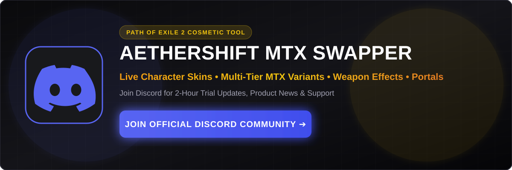
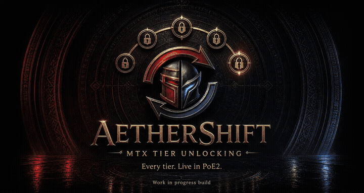

# AetherShift – Live Cosmetic Customization & MTX Swapper for Path of Exile 2

  

  

---

## ⚡ Overview

**AetherShift** is a Windows application for live cosmetic customization in **Path of Exile 2**. It supports character skins and effects, back attachments, weapon effects, portal effects, cursor customization and multi-tier MTX variants.

Supported AetherShift selections do not require the selected MTX to be owned on the Path of Exile account. This does not grant MTX ownership, add cosmetics to the account or modify account entitlement records.

> **Note**: This repository contains public documentation and media for AetherShift. Application source code is not distributed through this repository.

---

## 📚 Project Documentation

To help users understand AetherShift features, compatibility, and operation, detailed documentation is organized in the following guides:

- 🎨 **[Features Overview](docs/features.md)** – Detailed breakdown of supported cosmetic categories (character skins, character effects, back attachments, weapon effects, portal effects, cursor customization, multi-tier MTX variants).
- 🖥️ **[Compatibility Matrix](docs/compatibility.md)** – System requirements for Windows 10/11 64-bit, Steam, and Standalone launchers.
- 🚀 **[Getting Started Guide](docs/getting-started.md)** – Setup instructions and trial/licensing framework information.
- ❓ **[Frequently Asked Questions](docs/faq.md)** – Answers regarding functionality, account entitlement, and game updates.
- 🔒 **[Known Limitations](docs/known-limitations.md)** – Operational scope, client-side boundaries, and display mode recommendations.
- 🛠️ **[Troubleshooting Guide](docs/troubleshooting.md)** – Diagnostic guidance for display modes and patch updates.

---

## 🎬 Video Demonstrations

Watch AetherShift live cosmetic customization and multi-tier MTX variant selection in action:

<table align="center" width="100%">
  <tr>
    <td align="center" width="50%">
      <a href="https://www.youtube.com/watch?v=P0HH_YtBKVE">
         
         
        <b>▶️ Watch Demonstration #1: Live Armor & Weapon Cosmetic Customization</b>
      </a>
    </td>
    <td align="center" width="50%">
      <a href="https://www.youtube.com/watch?v=noToG2CtNKc">
         
         
        <b>▶️ Watch Demonstration #2: Multi-Tier MTX Variants & Feature Overview</b>
      </a>
    </td>
  </tr>
</table>

---

## 📸 Cosmetic Transformation Previews

<table align="center" width="100%">
  <tr>
    <td align="center" width="33%">
      <b>🛡️ Character Skins & Armor</b>  
      <code>Default Appearance</code> ➔ <code>Multi-Tier Cosmetic Variant</code>  
      <i>Applied live in-game without client restarts.</i>
    </td>
    <td align="center" width="33%">
      <b>⚔️ Weapon & Character Effects</b>  
      <code>Base Weapon Visual</code> ➔ <code>Supported Weapon Effect</code>  
      <i>Dynamic particle glows and visual trail effects.</i>
    </td>
    <td align="center" width="33%">
      <b>🌌 Portals & Cursor Customization</b>  
      <code>Standard Portal</code> ➔ <code>Supported Portal Effect</code>  
      <i>High-visibility cursors for endgame mapping clarity.</i>
    </td>
  </tr>
</table>

---

## 💻 Confirmed System & Client Compatibility

- **Operating Systems**: Windows 10 (64-bit) and Windows 11 (64-bit).
- **Game Launchers**: Steam Path of Exile 2 client and Official Path of Exile launcher (Standalone).

For technical specifications and display mode recommendations, see the [Compatibility Matrix](docs/compatibility.md).

---

## 🌐 Official Community & Support

Software updates, compatibility information, and technical support are centralized through official platforms:

- 🌐 **Official Website**: [aetherexile.com](https://www.aetherexile.com/)
- 💬 **Discord Community**: [Aether Exile Discord Community](https://discord.gg/nxGqxpHSdK)
